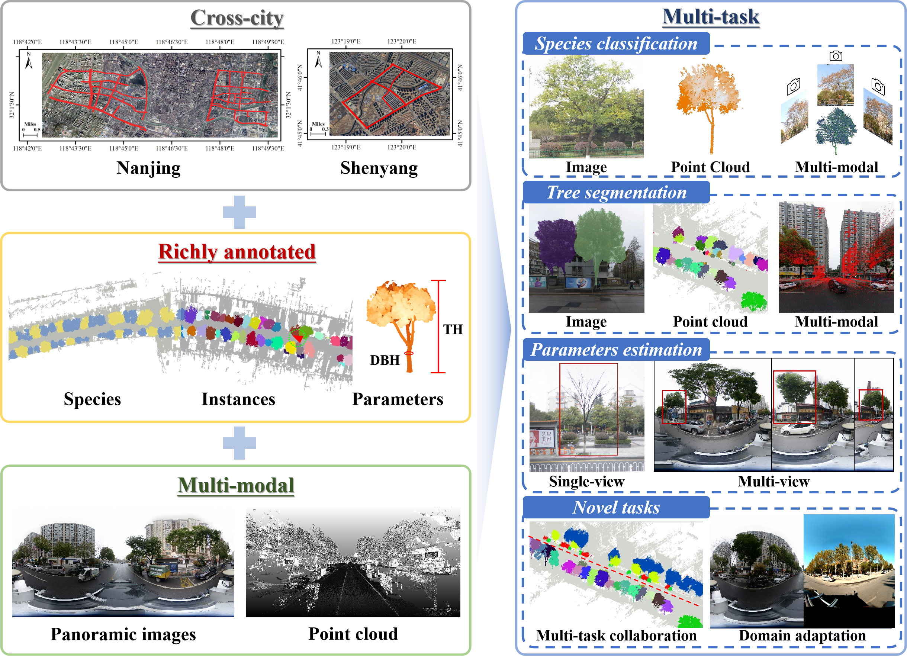
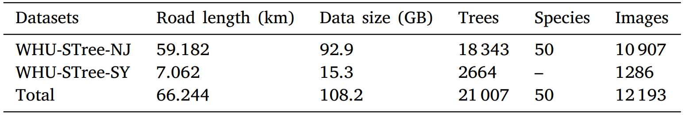

<h1 align="center"> <p> WHU-STree </p></h1>
<h3 align="center">
<a href="https://github.com/WHU-USI3DV/WHU-STree/" target="_blank">WHU-STree: A Multi-modal Benchmark Dataset for Street Tree Inventory</a>
</h3>

  The study presents WHU-STree, a pioneering multi-modal dataset designed to address critical gaps in urban street tree inventory research. By integrating synchronized point clouds and high-resolution images collected across two geographically distinct cities, WHU-STree offers a comprehensive resource for advancing automated urban forestry management. The dataset encompasses 21,007 annotated tree instances with species labels for 50 tree species and morphological parameters, enabling simultaneous support for tasks such as individual tree segmentation, species classification, and 3D morphological analysis. Its cross-city collection strategy, combined with rich annotations and multi-modal integration, sets a new benchmark for evaluating algorithmic generalization and robustness in real-world urban environments.

<p align="center">
  
</p>

## 📌 Download

Fill in this  [**Data Request**](https://wj.qq.com/s2/24852142/0539/) to obtain the dataset. 

**Given that this work is still under review, necessary updates may follow accordingly. Therefore, please stay tuned to this project.**

## ✅ Competition

Utilizing **a portion of** the dataset, we organized an individual tree segmentation [**competition**](https://www.codabench.org/competitions/8821/) for the upcoming 9th China LiDAR Conference.

For detailed competition specifications, please refer to the [**official conference website**](http://lidar2025wuhan.com/)

<s>Participants may access the competition-version training and testing datasets by fill out this [**Data Request**](https://wj.qq.com/s2/22633489/3p1t/).</s>

Since the competition has concluded, we will no longer provide the competition-version data.

## ✨ Dataset

### 1 Statistics

Statistics of WHU-STree dataset.

<p align="center">
  
</p>

### 2 Folder structure and format

The folder structure of our dataset:

 ```
   WHU-STree
   ├── 00/                                             # Road 00
   │   ├── hdi/                                        # Processed POS Data
   │   │   ├── 1/                                      # POS data for Trajectory 1
   │   │   │   └── traj.csv                            
   │   │   └── 2/                                      # POS data for Trajectory 2
   │   │       └── traj.csv
   │   ├── image/                                      # Panoramic Image Data
   │   │   ├── 1/                                      # Images for Trajectory 1
   │   │   │   ├── 00000000-01-20201218104358926.jpg   
   │   │   │   ├── 00000000-01-20201218104401126.jpg
   │   │   │   └── ...                      
   │   │   └── 2/                                      # Images for Trajectory 2
   │   │       ├── 00000000-01-20201218104402944.jpg
   │   │       ├── 00000000-01-20201218104404539.jpg
   │   │       └── ...
   │   └── PCD/                                        # Point Cloud Data
   │       ├── 1.ply                                   # Point cloud for Trajectory 1
   │       └── 2.ply                                   # Point cloud for Trajectory 2
   ├── 01/                                             # Road 01
   │   └── ...                                         # Identical substructure
   └── ...                                             # Other roads

   ```
Specifically,

#### (1) Processed POS Data 
Each `traj.csv` records the ​**exterior orientation parameters**​ for every panoramic image at its exposure moment along the same trajectory.  

​**Per-record structure**:  
`[image_filename, X, Y, Z, heading, pitch, roll]`  *(One record per image)*  

​**Functionality**:  
These parameters enable ​**coarse registration**​ between point clouds and images.

---

#### (2) Point Cloud Attributes  
Each `.ply` point cloud file contains per-point attributes:  
`[x, y, z, intensity, tree, label]`  

​**Among them**:  
- `tree`: Instance label 
- `label`: Tree species label

Details of tree species annotations are shown in the following table. It should be noted that, during the benchmark experiment, we have grouped species less than 150 instances into "others" as shown in the table. However, we consider the original annotations of these "others" species to remain valuable, and therefore their labeling information has been preserved in the "label" field, specifically for those with label IDs greater than 17.

<p align="center">
  
</p>

## 📊 Benchmark


## ⭐ Citation

This work is currently under review. If you find our work useful for your research, we kindly invite you to follow updates on this project.

