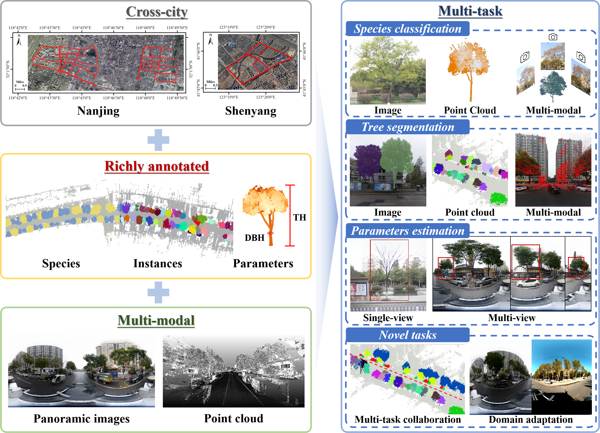
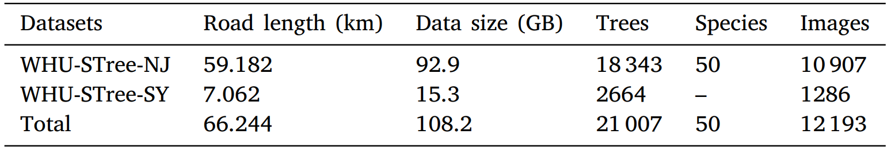
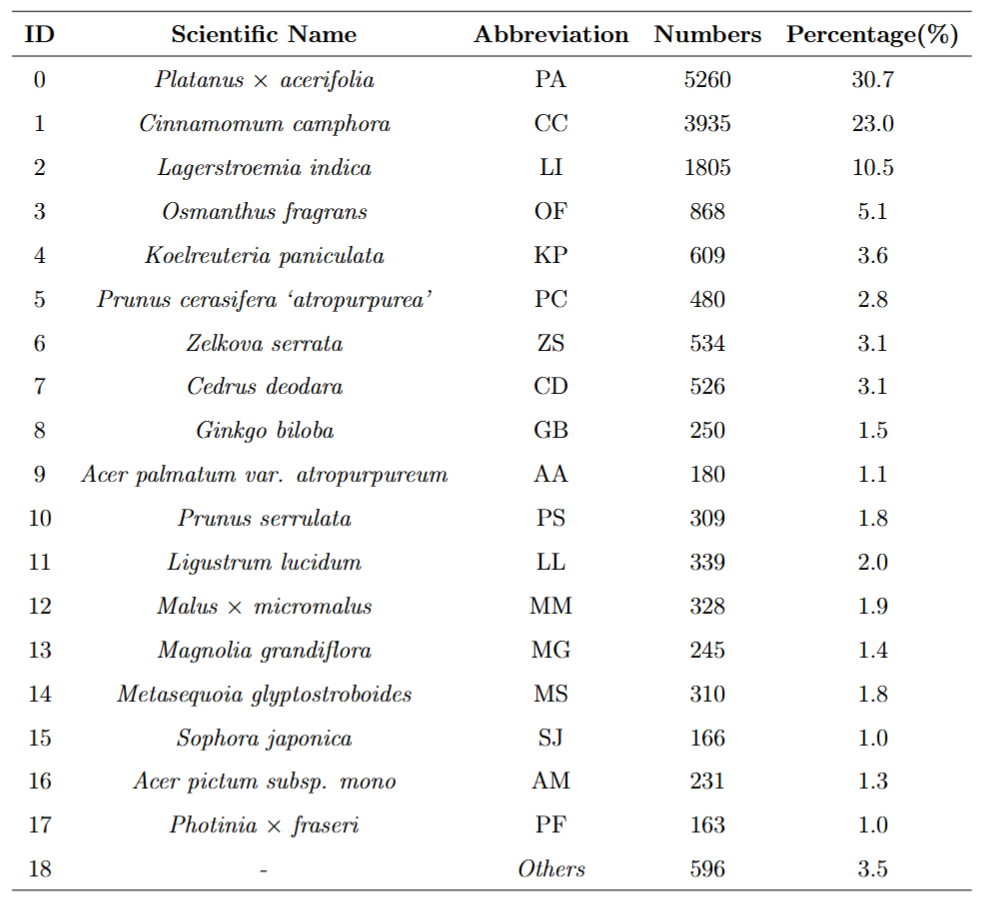

<h1 align="center"> <p> WHU-STree: A Multi-modal Benchmark Dataset for Street Tree Inventory </p></h1>
<h3 align="center">
</h3>
This is the official repository of the following publication:

> **WHU-STree: A Multi-modal Benchmark Dataset for Street Tree Inventory**<br/>
> *ISPRS Journal of Photogrammetry and Remote Sensing, 2026*<br/>
> [**Paper**](https://doi.org/10.1016/j.isprsjprs.2026.02.011)

## 🔭 Introduction
  The study presents WHU-STree, a pioneering multi-modal dataset designed to address critical gaps in urban street tree inventory research. By integrating synchronized point clouds and high-resolution images collected across two geographically distinct cities, WHU-STree offers a comprehensive resource for advancing automated urban forestry management. The dataset encompasses 21,007 annotated tree instances with species labels for 50 tree species and morphological parameters, enabling simultaneous support for tasks such as individual tree segmentation, species classification, and 3D morphological analysis. Its cross-city collection strategy, combined with rich annotations and multi-modal integration, sets a new benchmark for evaluating algorithmic generalization and robustness in real-world urban environments.

<p align="center">
  
</p>

## 🆕 News
- 2025-03-04: The **reference data** and **Shenyang subset** have been supplemented in the download links, enabling access to the final complete version of the dataset.
- 2026-02-04: **WHU-STree** is accepted by **ISPRS J**!

## 📌 Download

Fill in this  [**Data Request**](https://wj.qq.com/s2/24852142/0539/) to obtain the dataset. We provide download links for both Baidu Netdisk and Google Drive.

**As the download links have changed multiple times, please ensure that you have obtained the final complete dataset. We welcome any questions or suggestions and would be grateful for your valuable feedback and guidance.**

## ✅ Competition

Utilizing **a portion of** the dataset, we organized an individual tree segmentation [**competition**](https://www.codabench.org/competitions/8821/) for the 9th China LiDAR Conference.

For detailed competition specifications, please refer to the [**official conference website**](http://lidar2025wuhan.com/)

<s>Participants may access the competition-version training and testing datasets by fill out this [**Data Request**](https://wj.qq.com/s2/22633489/3p1t/).</s>

Since the competition has concluded, we will no longer provide the competition-version data.

## ✨ Dataset

### 1 Statistics

Statistics of WHU-STree dataset.

<p align="center">
  
</p>

### 2 Folder structure and format

The folder structure of our dataset:

 ```
   WHU-STree-NJ/SY
   ├── 00/                                             # Road 00
   │   ├── hdi/                                        # Processed POS Data
   │   │   ├── 1/                                      # POS data for Trajectory 1
   │   │   │   └── traj.csv                            
   │   │   └── 2/                                      # POS data for Trajectory 2
   │   │       └── traj.csv
   │   ├── image/                                      # Panoramic Image Data
   │   │   ├── 1/                                      # Images for Trajectory 1
   │   │   │   ├── 00000000-01-20201218104358926.jpg   
   │   │   │   ├── 00000000-01-20201218104401126.jpg
   │   │   │   └── ...                      
   │   │   └── 2/                                      # Images for Trajectory 2
   │   │       ├── 00000000-01-20201218104402944.jpg
   │   │       ├── 00000000-01-20201218104404539.jpg
   │   │       └── ...
   │   └── PCD/                                        # Point Cloud Data
   │       ├── 1.ply                                   # Point cloud for Trajectory 1
   │       └── 2.ply                                   # Point cloud for Trajectory 2
   ├── 01/                                             # Road 01
   │   └── ...                                         # Identical substructure
   └── ...                                             # Other roads
   └── ...  
   └── reference_data/                                 # Reference data for test dataset
       ├── 00_1.npy
       └── ...

   ```
Specifically,

#### (1) Processed POS Data 
Each `traj.csv` records the ​**exterior orientation parameters**​ for every panoramic image at its exposure moment along the same trajectory.  

​**Per-record structure**:  
`[image_filename, X, Y, Z, heading, pitch, roll]`  *(One record per image)*  

​**Functionality**:  
These parameters enable ​**coarse registration**​ between point clouds and images.

---

#### (2) Point Cloud Attributes  
Each `.ply` point cloud file contains per-point attributes:  
`[x, y, z, intensity, tree, label]`  

​**Among them**:  
- `tree`: Instance label 
- `label`: Tree species label

Details of tree species annotations are shown in the following table. It should be noted that, during the benchmark experiment, we have grouped species less than 150 instances into "others" as shown in the table. However, we consider the original annotations of these "others" species to remain valuable, and therefore their labeling information has been preserved in the "label" field, specifically for those with label IDs greater than 17.

<p align="center">
  
</p>

#### (3) Reference data 
Researchers can use the provided ground truth data to evaluate algorithm performance. The files are in **int16** `.npy` format and are named as `[road_id]_[ply_id].npy`.

## 📊 Benchmark

We have established benchmarks for two core tasks: **tree species classification** and **individual tree segmentation**. Additionally, we have introduced a **species-specific benchmark** for individual tree segmentation. Detailed information can be found in our paper.

## ⭐ Citation

If you find our work useful in your research, please consider citing:

```
@article{ding2026whu,
  title={WHU-STree: A multi-modal benchmark dataset for street tree inventory},
  author={Ding, Ruifei and Chen, Zhe and Fan, Wen and Long, Chen and Xiao, Huijuan and Zeng, Yelu and Dong, Zhen and Yang, Bisheng},
  journal={ISPRS Journal of Photogrammetry and Remote Sensing},
  volume={233},
  pages={519--542},
  year={2026},
  publisher={Elsevier}
}
```

